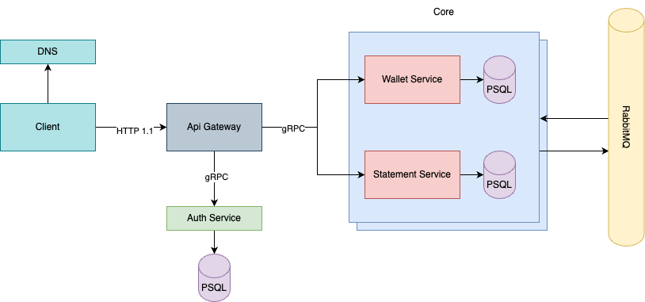
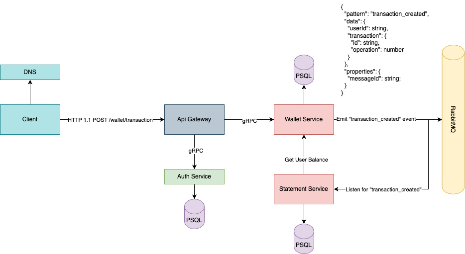
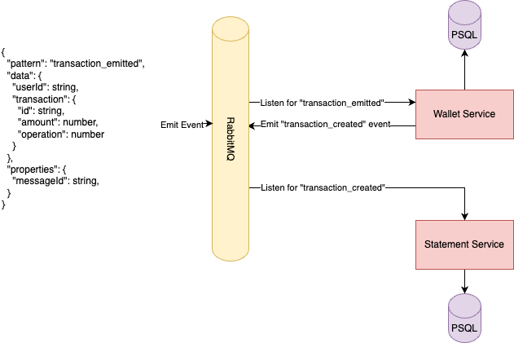
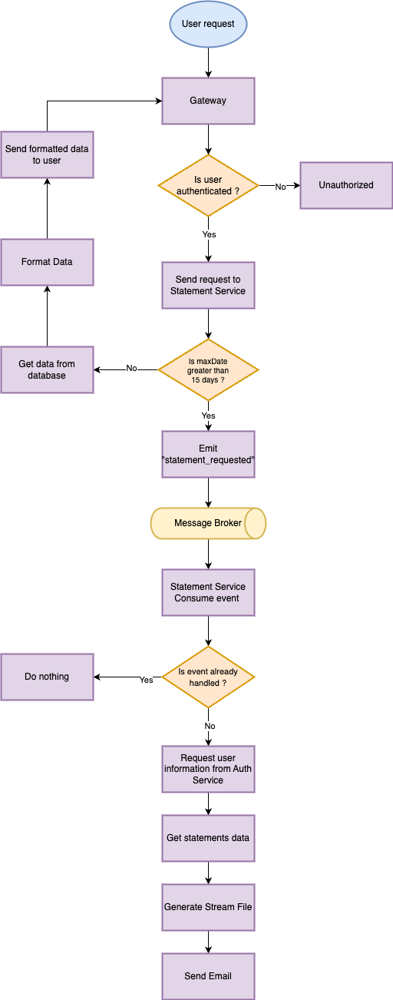

# Digital Wallet

A simple project based on microservices and NodeJS.

## [ :mag: ] About the services

This project counts with 3 microservices, they are: 

1. Auth Service: Responsible for user authentication, there are routes like: sign-in and sign-out and even user info consultation.
2. Wallet Service: The core service, responsible for receive requests or events to deal with transactions such as: deposit, withdraw, purchase, cancellation and reversal. Also, we can check user balance on this service.
3. Statement Service: Responsible to store the statement after each transaction and generate statement's history.

## [ :wrench: ] Setup

First of all, we need to have [Docker](https://docs.docker.com/engine/install/) already installed on our machine. After that, we need to fill the `.env` files according to each `.env.example` file on folders. With all these prerequisites done, we can run the services:

We are about to run multiple dockerized services, so to prevent memory leaks we are going to run them individually. We can run in the following sequence: 

1. `docker-compose up -d postgres`
2. `docker-compose up -d rabbitmq`
3. `docker-compose up -d auth_service`
4. `docker-compose up -d wallet_service`
5. `docker-compose up -d statement_service`
6. `docker-compose up -d api_gateway`

With all these services running, we can hit at `http://localhost:3000/docs` to see all routes available.

### [ :construction_worker: ] Application Tests

This project contain unit tests on each service, to run them you can just type `yarn test` on service folder. Example:

`cd auth-service && yarn test`

## [ :books: ] Architecture

About the project's architecture, we have a microservice's architecture, with API Gateway to handle requests. We setup release `HTTP 1.1` calls to gateway and it is responsible to call each service -  according to the request - through `gRPC` calls. 

For data persistence, we have 3 databases running inside the same postgres' instance on docker, according to [database per service pattern](https://microservices.io/patterns/data/database-per-service.html). The main idea to use postgres is to ensure scalability and fast write.

Regarding to event broker, we are using `RabbitMQ` due his architecture based on Erlang machine (which have highly perfomance to distributed applications).

### [ :dollar: ] The transaction flow

To created a transaction we can handle it in two ways: through API request and by emitting an event. Below we can see more about:

> When creating a transaction through API, we need to be authenticated. Ensuring that, the API will request `wallet-service` what is the core to handle transactions. When a transaction is created, an event is emitted to `statement_queue` and then the `statement-service` consume and handle it.

> Pretty similar to API request, when `wallet-service` consumes an `transaction_emitted` event, we handle it in same way, just leaving out the authentication.

### [ :computer: ] Statement generation flowchart

